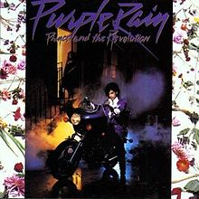

# paisley


SPA engine that sends HTML to clients and handles
events via WebSocket. Ideal for smaller apps,
built *very* small teams (like, 1 person).

Named after the :goat:, Prince Rogers Nelson's,
Paisley Park recording studio.

Fairly experimental.

## Rationale
This was partially made just for fun, but also to
shrink development for solo apps. No need to maintain both
an Angel server *and* a React/Angular frontend, etc. Also,
there's no need to use a module bundler.

## Caveats/Bugs
* You need to roll-your-own state management, especially to
persist state after a reconnect.

`window.localStorage` is sent to `Component.afterCreate`.
Use it accordingly.

## Installation
In your `pubspec.yaml`:

```yaml
dependencies:
  paisley: ^0.0.0
```